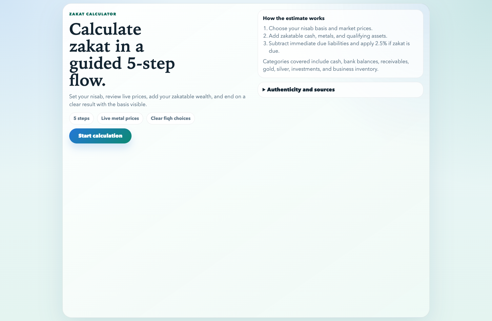
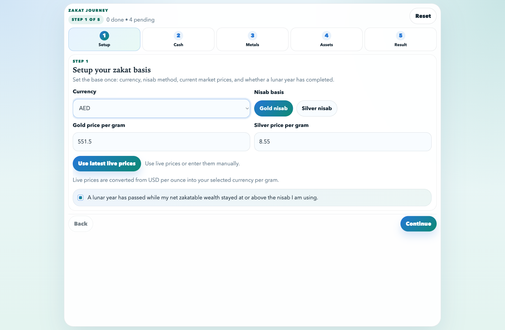
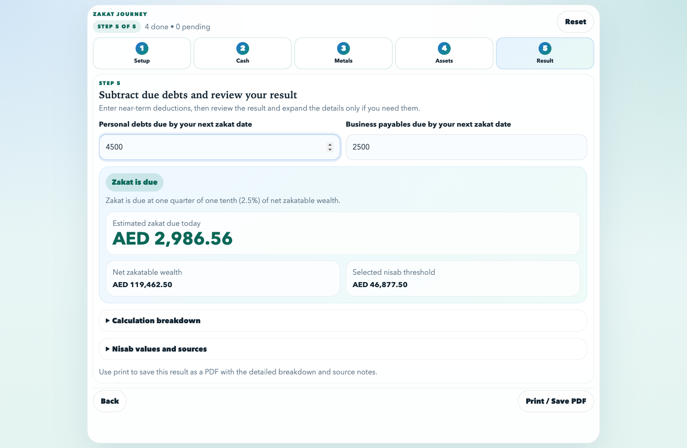
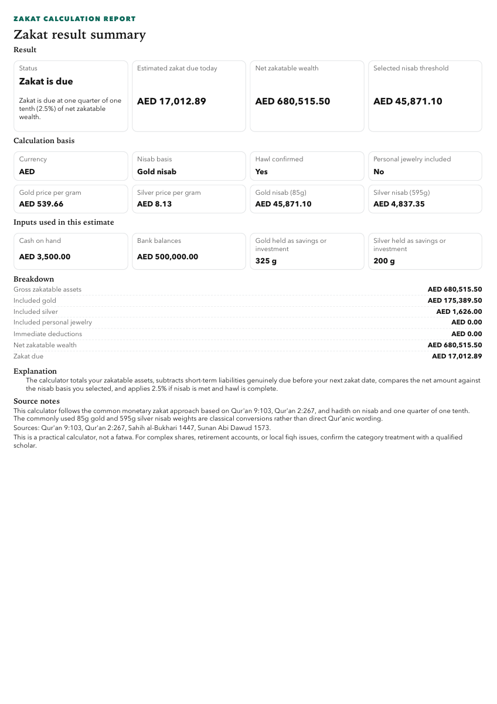

# Zakat Calculator

A clean, guided, mobile-friendly zakat calculator for cash, gold, silver, investments, and other common zakatable assets.

This project is built to make zakat calculation easier for everyday users without turning the experience into a long, confusing finance form. Instead of asking for everything on one crowded screen, it walks the user through a simple 5-step journey, shows a clear result, and keeps the calculation basis visible throughout.

Live app: [zakat.waahid.com](https://zakat.waahid.com/)

## Why this project exists

Many zakat tools are either:

- too simplistic to be useful
- too dense for non-technical users
- unclear about what they include and exclude
- weak on mobile
- vague about their calculation basis

This app is designed to fix that.

It aims to be:

- easy to use for first-time users
- fast enough for annual personal use
- clear about what is being counted
- explicit about fiqh-sensitive choices
- practical for real people on phones and laptops

## Screenshots

### Landing page



### Guided setup step



### Result screen



### Printable report



Sample PDF: [zakat-calculation-sample.pdf](docs/sample-report/zakat-calculation-sample.pdf)

## What makes it useful

- Guided flow: users move through one step at a time instead of facing one huge form.
- Mobile-first UI: the layout is designed to stay usable on smaller screens.
- Multi-currency support: currently supports AED, USD, SAR, GBP, EUR, INR, and PKR.
- Live metal pricing: users can fetch current gold and silver prices instead of entering them manually.
- Built-in learning panel: users can open a concise in-app guide on what zakat is, why it is paid, and what this calculator covers.
- Clear result: zakat due, net zakatable wealth, and nisab threshold are shown in a focused summary.
- Print-ready output: the final result can be printed or saved as a one-page PDF with the detailed breakdown and source notes.
- Offline-friendly record: users can keep a printed copy of their zakat calculation for personal records, review, or offline reference.
- Honest fiqh choices: personal jewelry is left as a user choice instead of being silently forced.
- Lightweight stack: plain HTML, CSS, and JavaScript with no heavy frontend framework.

## What the calculator covers

- Cash on hand
- Bank balances
- Unspent income still held
- Recoverable money owed to the user
- Gold held as savings or investment
- Silver held as savings or investment
- Personal jewelry, as an explicit user-controlled option
- Investments
- Business inventory
- Other zakatable assets
- Immediate personal debts due before the next zakat date
- Immediate business liabilities due before the next zakat date

## What it does not cover

- Livestock zakat
- Agricultural produce
- Mining, treasure, or specialized categories
- Complex retirement, pension, trust, or corporate structures
- Local fiqh edge cases that need scholar-specific review

This is a practical calculator, not a fatwa.

## How the app calculates zakat

The app follows a common monetary zakat approach:

1. The user chooses a nisab basis: gold or silver.
2. The app uses either manually entered prices or fetched live gold and silver prices.
3. The user enters zakatable wealth across the supported asset categories.
4. The app subtracts short-term liabilities genuinely due before the next zakat date.
5. If the user confirms that a lunar year has passed while their zakatable wealth remained at or above nisab, the app applies 2.5% to the net zakatable amount.

At the end of the journey, the user can also print or save the result as a PDF, making it easy to keep an offline copy of the full zakat calculation and breakdown.

### Fiqh notes

- Gold nisab is commonly represented as 85g.
- Silver nisab is commonly represented as 595g.
- Personal jewelry remains a fiqh difference, so the app leaves it as an explicit user choice.
- The app is intentionally conservative about clarity: it explains categories, shows the selected nisab threshold, and avoids pretending that disputed issues are settled.

## Authenticity basis

The calculator UI and methodology are anchored around the commonly cited Qur'anic and hadith basis for zakat on monetary wealth:

- [Qur'an 9:103](https://quran.com/9/103)
- [Qur'an 2:267](https://quran.com/2/267)
- [Sahih al-Bukhari 1447](https://sunnah.com/bukhari:1447)
- [Sunan Abi Dawud 1573](https://sunnah.com/abudawud:1573)

The widely used 85g gold and 595g silver nisab figures are classical conversions derived from the hadith thresholds of 20 dinars and 200 dirhams.

## Product principles

- Keep the UI clean.
- Show only the most important information by default.
- Help users finish the full journey quickly.
- Preserve transparency in the result.
- Make the app feel trustworthy without overwhelming the user.

## Tech stack

- HTML
- CSS
- Vanilla JavaScript
- Node.js local server
- Vercel for deployment
- A small serverless endpoint for live metal pricing

## Project structure

```text
.
├── index.html           # landing page, calculator shell, print layout
├── styles.css           # full UI styling
├── app.js               # journey flow, rendering, print behavior, persistence
├── calculator.js        # zakat calculation engine
├── pricing.js           # live metal pricing client logic
├── api/live-prices.js   # serverless endpoint for live pricing on Vercel
├── live-pricing.js      # pricing helpers
├── server.js            # local dev server
├── docs/screenshots     # README screenshots
└── *.test.js            # calculation and pricing tests
```

## Run locally

Requirements:

- Node.js 18+

Start the local server:

```bash
npm install
npm start
```

Then open:

```text
http://127.0.0.1:4173
```

## Run tests

```bash
npm test
```

## Deploy on Vercel

This project is ready for Vercel deployment.

```bash
npx vercel
npx vercel --prod
```

The project already includes:

- SEO metadata
- Open Graph and Twitter tags
- structured data
- `robots.txt`
- `sitemap.xml`
- `site.webmanifest`
- social preview assets
- a Vercel config

If you change the production domain later, update the canonical, Open Graph, Twitter image, `robots.txt`, and `sitemap.xml` URLs to match it.

## Contributing

Contributions are welcome.

If you want to improve the UI, calculation clarity, documentation, tests, accessibility, or fiqh transparency, please read [CONTRIBUTING.md](CONTRIBUTING.md).

## Good first contribution ideas

- Improve accessibility labels and keyboard flow
- Add more automated UI coverage
- Improve print layout further
- Refine copy for first-time users
- Add more currency options
- Improve the final breakdown and export experience
- Strengthen documentation around calculation assumptions

## Disclaimer

This app is a practical helper for estimating zakat due on common monetary assets. It is not a substitute for a qualified scholar, especially for complex holdings, local fiqh issues, or unusual asset categories.
